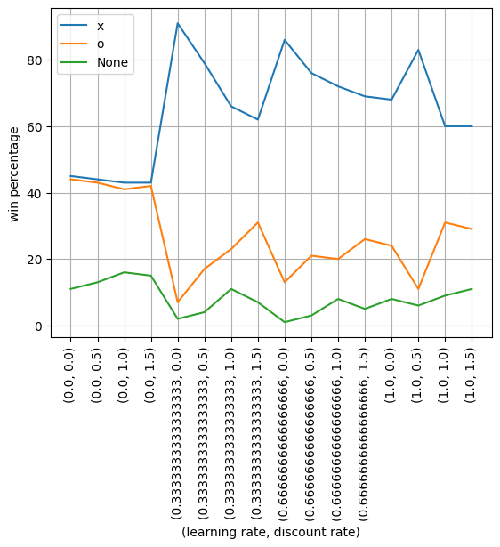
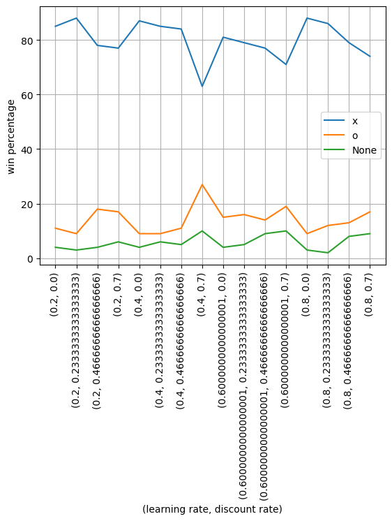
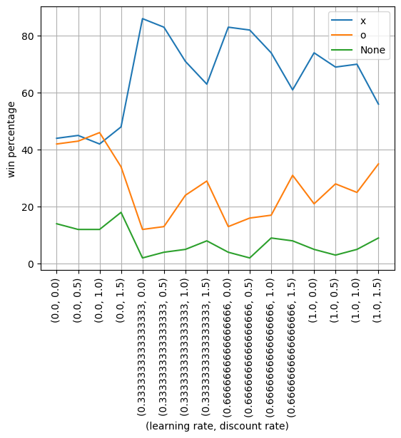
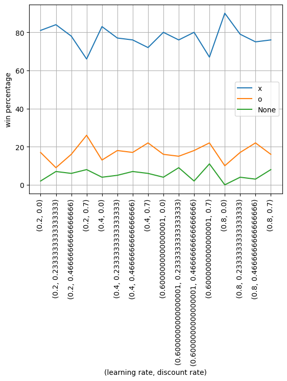
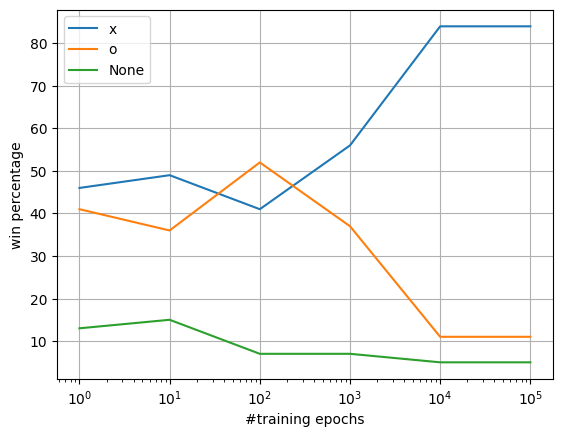
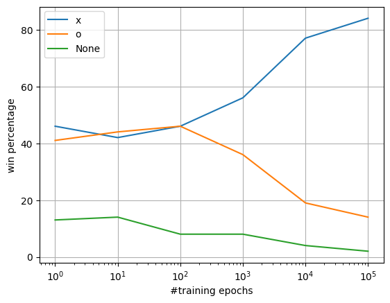

The adopted approach is based on a Q learning.  
In order to better address the training and have the possibility of considering the next-turn move the trajectory are considered separated (one for x and one for o). In this way is possible to update in a positive way the function even during losses, using the o trajectory to address what he did correctly and using the x trajectory to avoid repeating the same errors in the choices.  
Instead of the max of the next turn (in the formula) is considered the min in order to prefer the best next move that also minimize the chance of winning for the other player.

To chose the values for learning and discount rate the `training_param_graph` function is used, it provide also a way to zoom in a spot to further analyze finest results.  
## (Results with 1e5 training epochs)
## For `training`  

  
## For `training_2`  

# Test
Test is done via `training_epochs_graph` that let chose the parameters and test the training on different powers of 10 (0 till passed value)  
## For `training` (train till 1e6, lr = 0.8, dr = 0.0)  

## For `training_2` (train till 1e6, lr = 0.8, dr = 0.0)  
