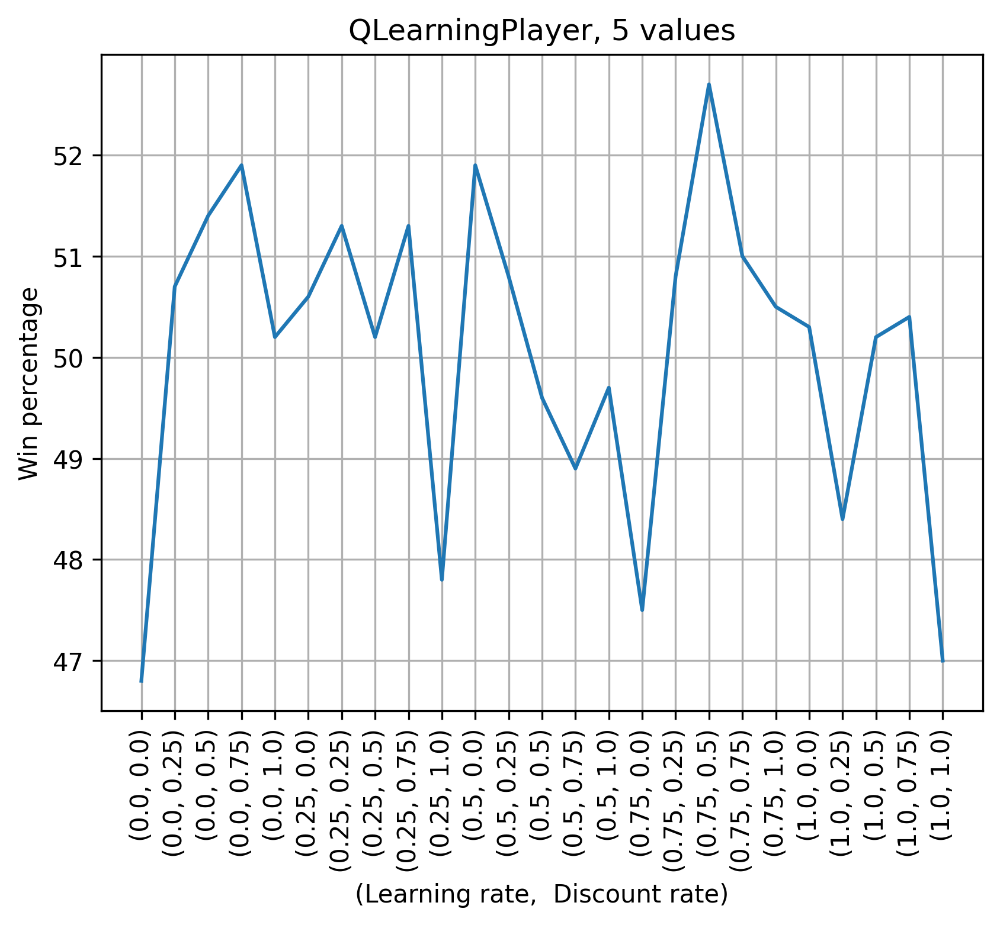
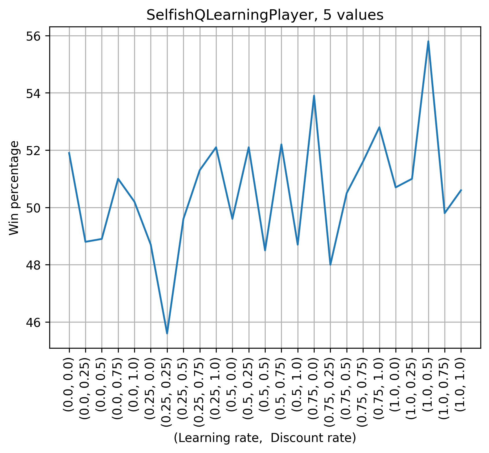
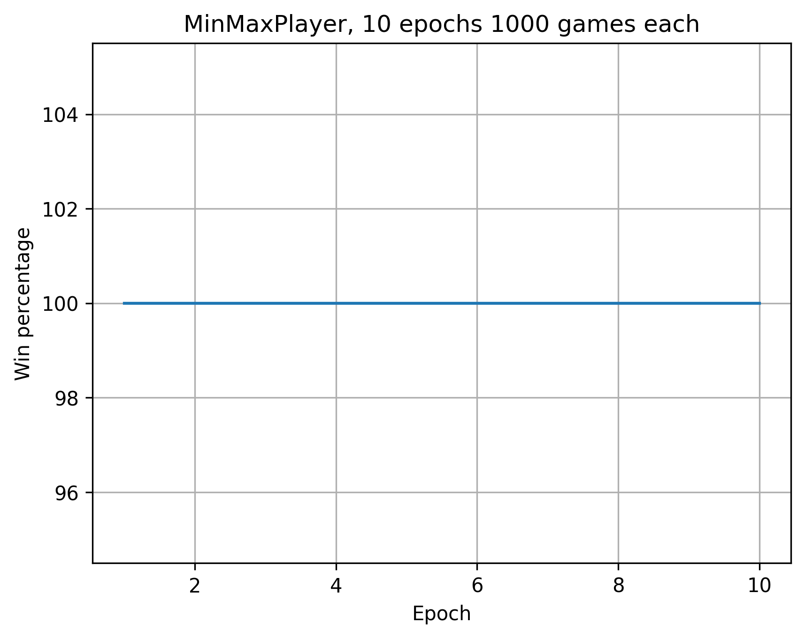
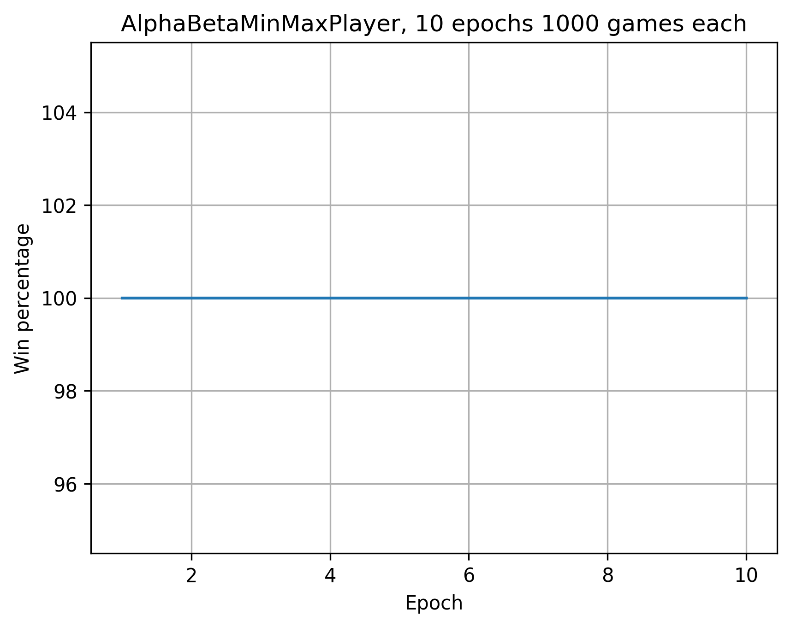

# Quixo Project

## Random
As reference 1000 games between two RandomPlayer are performed 10 times.

![Results of RandomPlayer tested 10 times on 1k games against the itself. Results: [48.4, 45.300000000000004, 47.4, 49.6, 48.199999999999996, 46.5, 45.7, 47.599999999999994, 45.0, 46.2]](./images/10games_Random.png)

## Q learning
As first approach a basic Q learning is tested. It is expected that the results with this method will be a lot similar to the random one. That because there are a lot of states that could be represented and at test time the table is not covering all of them so the player is going to choose at random between the available moves.  
The states are represented by a tuple composed by a score assigned to the current player and the score of the opponent. The score is computed converting the board into a binary representation with 1 in the position of current player's tokens and 0 elsewhere, using the coordinates (0, 0) as the LSB and (4, 4) as MSB. The binary representation is considered in its decimal form for more convenient using. By doing so we end up with two numbers, that can be represented on 25 bits, composing the states.  
Equivalent states are considered by rotating and flipping (both vertically and horizzontally) the state matrix in order to reduce the number of states to save.

### RESULTS
Testing for different learning and decay rates (5 values each, using `plot_lr_dr_performance` function) on 10k training games the results are not so significant and cannot give a precise insight on which pair is better to use.

  
The best results are achieved at 52.7% for the pair (0.75, 0.5) but as told before, it is not so much informative given the win percentage obtained.

Next the model is trained on ~1M games with learning and decay rate respectively 0.75 and 0.5. Then to test it the player is used against the RandomPlayer for 1k games 10 times.  
[Trained using instruction `QLearningPlayer.play_against(train=True, n_training_games=int(1e6), print_result=True, learning_rate=0.75, decay_rate=0.5, table_save_rate=int(5e4), load_table=False)`, tested with `plot_perf(QLearningPlayer, load_table=True, n_evaluation_epochs=10, n_evaluation_games=1000, save_plot=True)`.]

![Results of QLearningPlayer trained with lr=0.75 and dr=0.5 for ~1M games and tested 10 times on 1k games against the RandomPlayer. Results: [53.0, 50.2, 52.5, 52.1, 51.800000000000004, 51.800000000000004, 49.1, 49.4, 53.5, 51.5]](./images/10epochs_1000games_QL.png)

As it was expected, the training doesn't cover well the states and then the results resembles the random ones.

## Selfish Q learning
In order to reduce the number of states the opponent score is here removed to obtain the state and only the current player's one is used. In this way we pass from considering the board (for the state) as a 3-state matrix to a 2-state matrix reducing the number of possible state to represent (from 3^25 to 2^25, ~847 bilion less states, "only" 33 milion remaining).  
The problem that arise with this state representation is that in a given represented state a saved move could not be available because we are not considering the opponent's tokens in the embedding. In this case also the other 'good' saved moves (the ones with score > 0) are considered and in case they are all occupied it proceeds randomly.

### RESULTS
Also in this case the model is tested on 10k games with 5 different values for learning and decay rate using `plot_lr_dr_performance` and also this time the results are not so useful.

  
The best result is found for (1.0, 0.5) at 55.8% winning rate (again not significant).

Again, the model is trained on ~1M games with learning and decay rate respectively 1.0 and 0.5 and again the test is performed via 1k games for 10 times against RandomPlayer.  
[Trained using instruction `SelfishQLearningPlayer.play_against(train=True, n_training_games=int(1e6), print_result=True, learning_rate=1.0, decay_rate=0.5, table_save_rate=int(5e4), load_table=False, file_name='Selfish_Q_table')`, tested with `plot_perf(SelfishQLearningPlayer, load_table=True, n_evaluation_epochs=10, n_evaluation_games=1000, save_plot=True, file_name='Selfish_Q_table')`.]

![Results of SelfishQLearningPlayer trained with lr=1.0 and dr=0.5 for ~1M games and tested 10 times on 1k games against the RandomPlayer. Results: [52.7, 51.300000000000004, 50.0, 49.6, 53.0, 49.0, 47.599999999999994, 49.7, 50.1, 50.9]](./images/10epochs_1000games_SQL.png)

Again, also in this case the training doesn't cover well the states so the results resembles the random ones.

## MinMax
In this approach better results than before are expected given the fact that the player seek in the future to choose the move to perform. Using the end of the game as evaluation method in order to choose a move, the time required to explore all the possible reachable state is very high, so to reduce the computation time (for each single move) the search is limited to a `max_depth` depth reducing to 100^max_depth the number of nodes to explore but that could lead to a sub-optimal solution(100 is the combination of all the possible coordinates in the board with the 4 possible `Move` moves). To further reduce the number of computations only the real possible moves are explored passing from a branching factor of 100 to 44 (16 valid coordinates with 3 moves on each exept for the corners that have 2 applicable moves).  
The implementation of alpha-beta pruning improves more the move time given the fact that it reduce the number of nodes it needs to explore to choose the best one. The moves are explored in random order to try to reduce even more the search time (the best obtainable number of nodes to be explored is O(b^(m/2)) with the perfect ordering, with random is at least O(b^(3m/4)) with b representing the branching factor and m the max depth).   
The last improvement is added using a transposition table: this let the player saves the already explored states (even if rotated or flipped) for each depth and retrieve the previously seen best move in case it encounter it again and spare time. With the transposition table the AlphaBetaMinMaxPlayer with max_depth = 3 pass from around ~35 seconds per move to ~9 seconds.

Overall the improvements let reach a ~9s move with depth 3 starting from a move time of ~200s for the vanilla MinMax with the same depth.

### RESULTS
Both the MinMaxPlayer and AlphaBetaMinMaxPlayer are tested 10 times against the RandomPlayer for 1k games.

